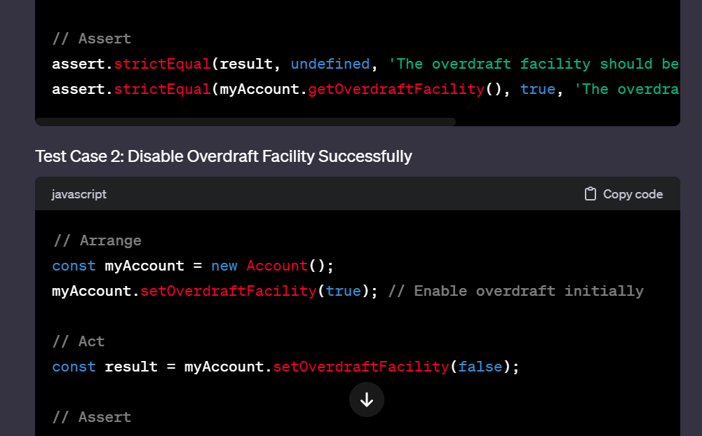
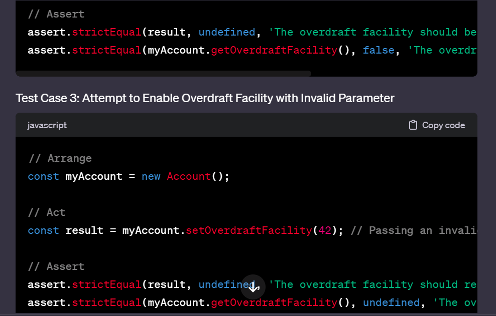
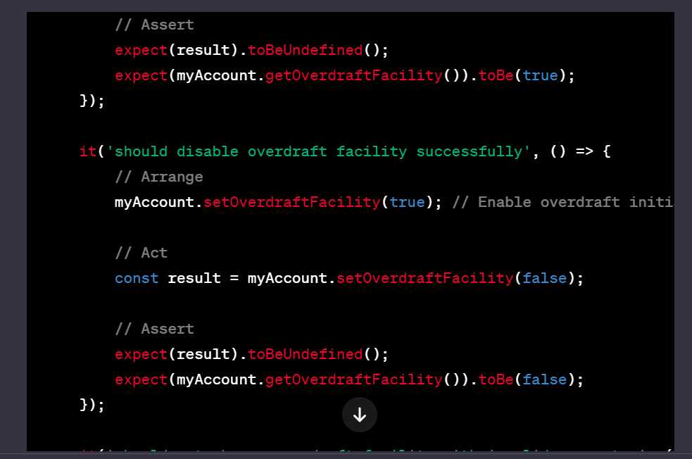

# The engineer can create domain models for simple user stories using simple, suitable prompts and a Generative AI tool (such as Chat-GPT)

# The engineer can write tests and/or working code that demonstrates the use of a Generative AI tool to identify and write test cases and/or code for tests

